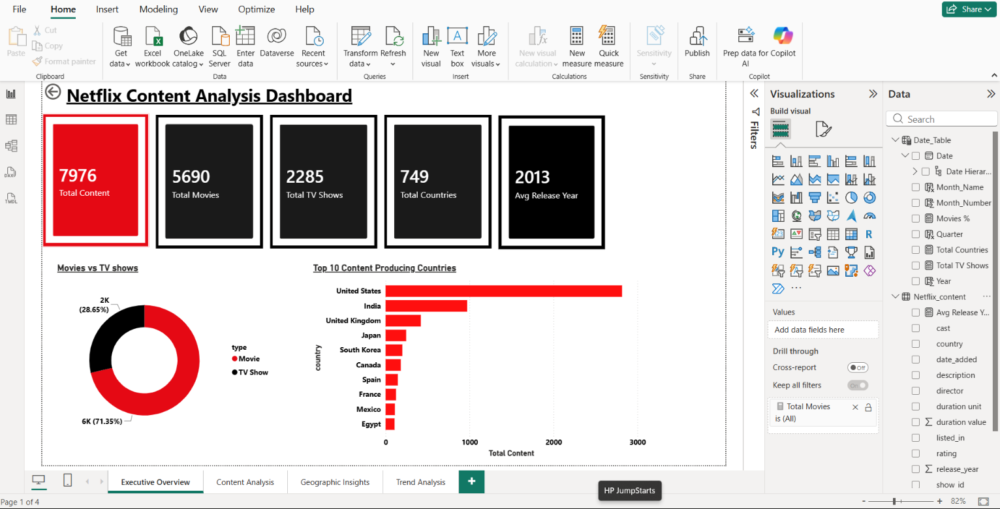
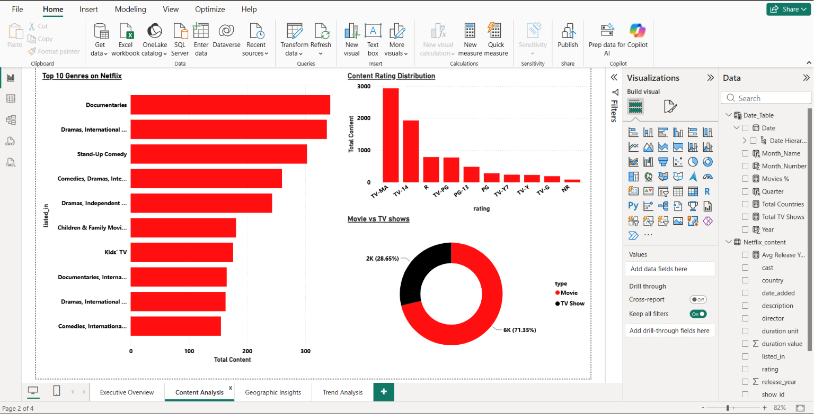
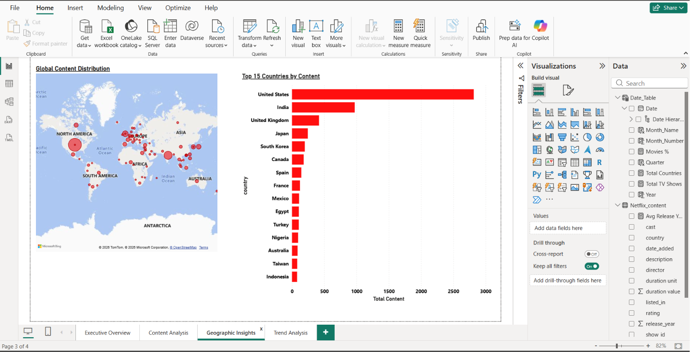
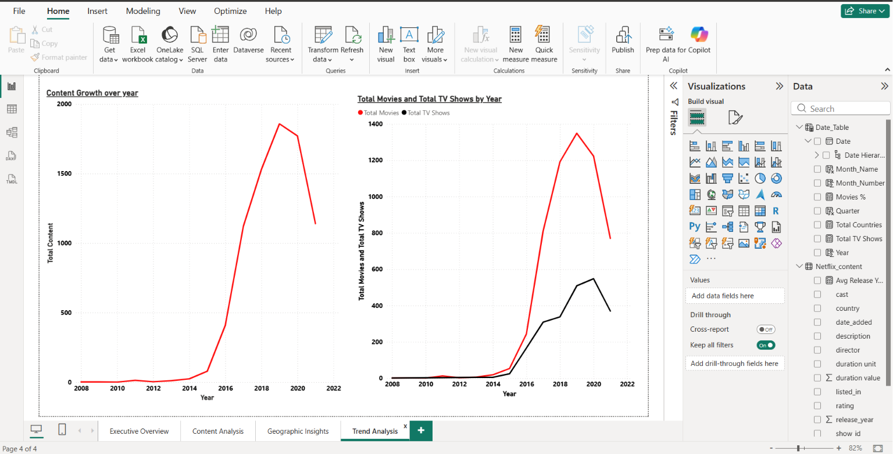

# 🎬 Business Intelligence Dashboard for Streaming Content Analysis


## 📊 Project Overview
Interactive 4-page Power BI dashboard analyzing 
Netflix's complete content library with 7,976 titles 
across 100+ countries.

Built as a portfolio project demonstrating 
end-to-end Business Intelligence skills including
data cleaning, data modeling, DAX calculations,
and interactive visualizations.

---

## 🎯 Business Questions Answered
1. What is Netflix's total content distribution?
2. Which countries produce the most content?
3. What genres dominate Netflix?
4. How has Netflix grown over the years?
5. What content ratings are most common?
6. How do Movies vs TV Shows compare?

---

## 🛠️ Tools & Technologies
| Tool | Purpose |
|------|---------|
| Power BI Desktop | Dashboard Creation |
| Power Query | Data Cleaning & Transformation |
| DAX | KPI & Measure Calculations |
| Data Modeling | Table Relationships |
| Microsoft Bing Maps | Geographic Analysis |

---

## 📈 Dashboard Pages

### Page 1 — Executive Overview


**KPIs:**
- Total Content: 7,976
- Total Movies: 5,690
- Total TV Shows: 2,285
- Total Countries: 749
- Avg Release Year: 2013

**Visuals:**
- Movies vs TV Shows Donut Chart
- Top 10 Content Producing Countries Bar Chart

---

### Page 2 — Content Analysis


**Visuals:**
- Top 10 Genres Bar Chart
- Content Rating Distribution Column Chart
- Movies vs TV Shows Donut Chart

---

### Page 3 — Geographic Insights


**Visuals:**
- Global Content Distribution World Map
- Top 15 Countries by Content Bar Chart

---

### Page 4 — Trend Analysis


**Visuals:**
- Content Growth Over Years Line Chart
- Movies vs TV Shows Growth Trend Line Chart

---

## 🔍 Key Business Insights
 USA produces the highest Netflix content (35%+)
📺 TV-MA is the most common content rating
🎭 Dramas & Documentaries are top genres
📈 Netflix content peaked in 2019-2020
🎬 71.35% Movies vs 28.65% TV Shows
🌍 Content spans 749 countries worldwide
🎬 Total 7,976 titles analyzed
📅 Average content release year is 2013
---

## ⚙️ Data Cleaning Steps

- ✅ Removed duplicate records using show_id
- ✅ Handled null/missing values in country, 
     director, rating, cast columns
- ✅ Fixed data types (date_added → Date, 
     release_year → Whole Number)
- ✅ Split duration column into 
     Duration_Value and Duration_Unit
- ✅ Removed error rows (Flying Fortress 
     title had incorrect data)
- ✅ Standardized text columns using Trim
- ✅ Removed rows where Country = "Unknown"
     (missing geographic data excluded for
     accurate geographic analysis)

> ⚠️ **Note on Data:**
> Original dataset contained 8,809 titles.
> After removing rows with Unknown country
> data, final dataset contains **7,976 titles**.
> This was a conscious data quality decision
> to ensure accurate geographic analysis.
> Unknown country records were excluded as
> they would create inaccurate insights in
> geographic visuals.

---

## 📐 DAX Measures Created

```dax
-- Total content count
Total Content = COUNTROWS(Netflix_content)

-- Total movies count
Total Movies = 
COUNTROWS(
    FILTER(Netflix_content,
    Netflix_content[type] = "Movie"))

-- Total TV Shows count
Total TV Shows = 
COUNTROWS(
    FILTER(Netflix_content,
    Netflix_content[type] = "TV Show"))

-- Unique countries count
Total Countries = 
DISTINCTCOUNT(Netflix_content[country])

-- Average release year
Avg Release Year = 
INT(AVERAGE(Netflix_content[release_year]))

-- Movies percentage
Movies % = 
DIVIDE([Total Movies],[Total Content],0) * 100
```

---

## 🗂️ Data Model
Netflix_content ──────── Date_Table

date_added    *    :    1    Date
Many-to-One Relationship

Cross Filter: Single
---

## 📁 Dataset
- **Source:** Kaggle
- **Dataset:** Netflix Movies and TV Shows
- **Original Records:** 8,809 titles
- **After Cleaning:** 7,976 titles
- **Link:** [Netflix Dataset](https://www.kaggle.com/datasets/shivamb/netflix-shows)

---

## 🚀 How to Use
1. Download `netflix.pbix` file
2. Open with Power BI Desktop (Free)
3. Download from: powerbi.microsoft.com/desktop
4. Explore all 4 dashboard pages
5. Interact with charts and slicers

---

## 📸 Dashboard Preview

### Executive Overview


### Content Analysis


### Geographic Insights


### Trend Analysis


---

## 👩‍💻 Author
**Tanishka Saraswat**
- LinkedIn:tanishka-saraswat

---

⭐ **If you found this project helpful, 
please star this repository!**

